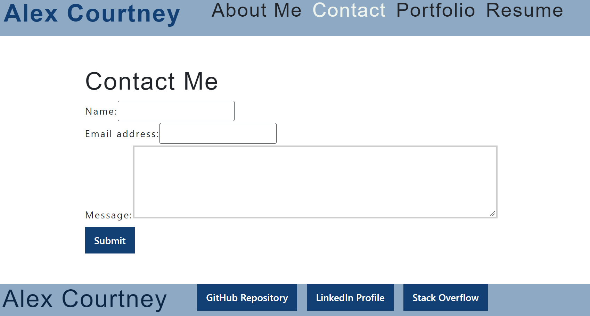
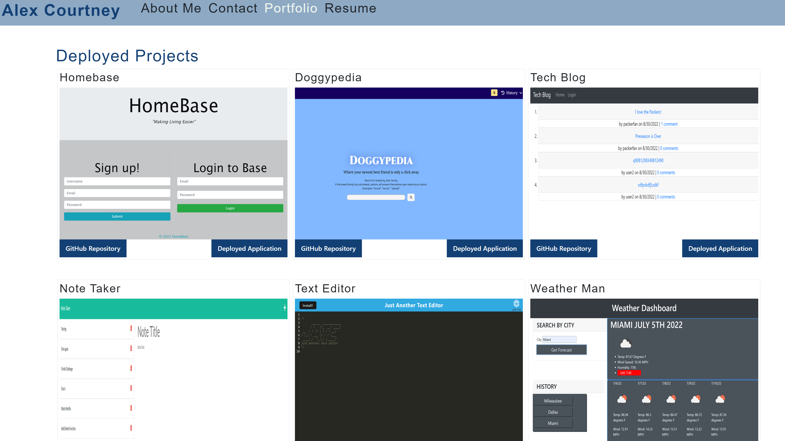
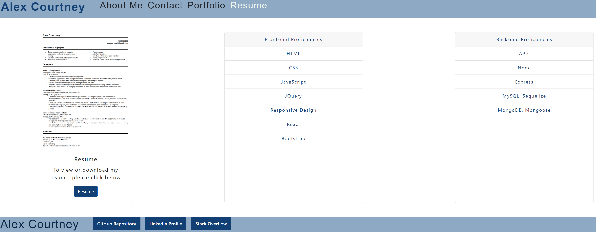

# React-Portfolio

## Description
This portfolio was built using React and Deployed using Netlify. Sections of the portfolio include About, Contact, Portfolio, and Resume. The about section contains background information. The contact section is front end only. Users can input their name, email and a message. Validation is programmed in to verify the email address and make sure no fields are blank. The portfolio sections features six of my recent deployed projects with buttons taking you to the GitHub repository and the live deployed application. The resume section includes a button which directs users to my resume on google docs which can be viewed and downloaded. It also features a list of my front-end and back-end proficiencies. The footer includes links to my GitHub and LinkedIn profiles as well as the Stack Overflow website. I do not currently have a profile on stackoverflow.

## Installation
No installation is required. The portfolio is deployed and fully functional at [deployed application](https://alex-courtney-portfolio.netlify.app/).

## Usage
No special instructions are required. Simply visit the application using the link above. 
 
 

 
 

 
 

 
 

